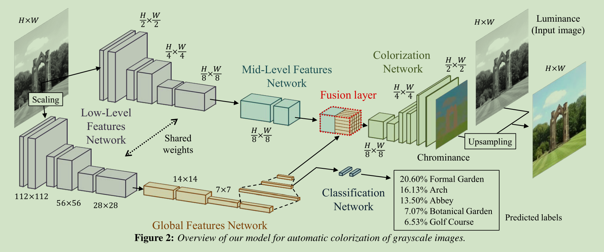
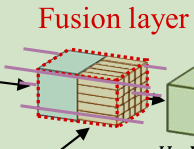

# Let-there-be-Color
## 概述
文章的目的简单且有趣，就是利用卷积神经网络给黑白照片（灰度图）上色。

什么是端到端：就是不用预处理，后处理数据提特征啥的了，直接把图片扔进去，把结果吐出来。

首先颜色怎么度量得有一个标准，文章使用的是 CIE lab颜色空间，用(x,y)来确定一个像素点的颜色。

 粗略介绍下机器学习：
机器学习说白了就是通过训练得到输入输出映射关系中的参数，就是输入输出中可能蕴含的某种映射关系，就比如一个线性函数y=ax+b,我们要确定这个函数其实就是得到参数a,b的值。  

那么我们现在最重要的是不是要告诉计算机我们想达到什么效果，这样的效果对应的参数就是我们想要的参数。于是我们给计算机的训练样本是有颜色的照片和它对应的黑白照片。就是告诉它这个黑白照片，我们想让它变成这个彩色照片，你给我把参数弄出来。  

本文就是要每个像素点预测的值跟实际的值相差最小，就是我们定义的损失函数。（这时候可能会疑惑还没开始就预测了？其实学习的过程是多次迭代的，第一次的参数可能就是随便给的，然后预测一次看下效果，效果不好再自动调整参数，再预测，再看效果...）  

损失函数：  
  
I,K为两张图片   m,n为图片长宽  （i,j）像素的lab值。图的每个像素点预测值跟实际值的差值的平方，然后再取平均。

目标函数（用来计算预测值的）：  
  
  
W就是权重值，b是偏移量，Q就是一个分支非线性函数，文章没说不清楚。图二就是图一的扩展，就是具体到每个像素点了，(u,v)就是像素值。

激活函数：
除了着色层的输出层使用Sigmoid激活函数以外，其他层激活函数均使用ReLU激活函数。（激活函数给神经元引入了非线性因素，使得神经网络可以任意逼近任何非线性函数，毕竟映射关系不可能都是线性这么简单）  
  
　　sigmod公式  
  
　　relu公式

## 模型
  
四个网络：底层特征提取网络，中层特征提取网络，全局特征提取网络，染色网络。下面一溜是普通的CNN，只不过这个CNN的前层没用Pooling层。上面的一溜其实是FCN，全连接网络，做语义分割用，语义分割就是尽量确定每个像素属于图片的哪一部分，比如判断这个像素是属于香蕉还是苹果的。

[CNN不清楚就看这](https://blog.csdn.net/qq_37813206/article/details/103431987)

0.低级特征提取网络  
　　网络中的前六层卷积（灰的）是公共的，里面的参数是完全一样的，值得说明的是，这六层网络用Stride=2代替了Pooling层，这样可以增加每层的空间信息。【有东西，可提问】

1.全局特征提取网络  
　　4层卷积层+3层全连接->256维向量

2.中层特征提取网络（H,W代表原始图片的高跟宽）  
　　2个卷积层->H / 8 × W / 8 × 256的小长方体

3.特征融合【有东西，可提问】  
　　我们可以把全局的特征看为1×1×256的小长方条，把他叠成H / 8 × W / 8形成一个跟中层特征一样大小的长方体，把这两个长方体串联到一起，形成一个H / 8 × W / 8×521的长方体。 就像是在告诉每一个小区域，我们在什么环境下，比如冬天的图片不要整成夏天了。  
  

4.分类（在全局特征提取网络后面）  
　　【可提问】为什么引入交叉熵,因为激活函数为sigmod，这样会使得w和b更新非常慢，可以克服方差代价函数更新权重过慢的问题。  
　　使用交叉熵和ＭＳＥ来训练这个分类网络,前一项其实就是MSE，后一项是交叉熵。  
  
5.染色网络  
　　[上采样，最邻近元法看这](https://blog.csdn.net/stf1065716904/article/details/78450997)  
　　用最后得到的像素颜色图直接给黑白照片上色。  
6.优化  
　　【可提问】既然任何分辨率的图片都可以输入，为什么224*224大小的性能最优。  
　　【可提问】使用Batch normalization批量标准化提高非常深的网络的学习速度。  
　　【可提问】为什么不用Stochastic Gradient Descent (SGD) 优化，而是采用ADADELTA [Zeiler 2012] optimizer优化。  
实验跟讨论--吹逼环节...  
网络结构上的设计并不新颖，也就是网络的各种组合，说不上创新性上有多大。但是作者的实验效果，总体上来看是很不错的，进行了多方位对比。

   

